# Function
## 01

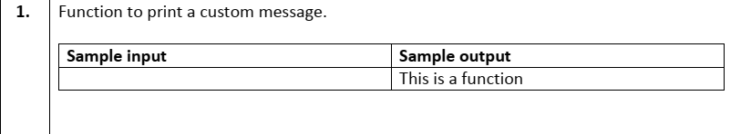
```c
#include <stdio.h>
void print_func()
{

    printf("This is a function\n");
}
int main()
{

    print_func();

    return 0;
}
```

## 02
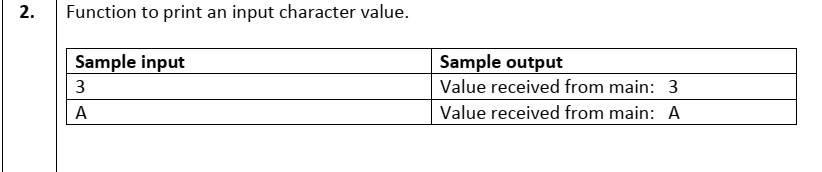

```c
#include <stdio.h>
void print_value(char input)
{

    printf("Value received from main: %c\n", input);
}
int main()
{

    char input;
    scanf(" %c", &input);

    print_value(input);
    return 0;
}
```

 ## 03

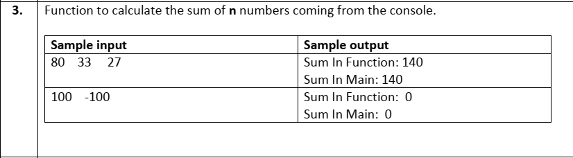

```c
#include <stdio.h>

int calculateSum(int n)
{
    int sum = 0;
    int num;

    for (int i = 0; i < n; i++)
    {
        scanf("%d",&num );
        sum += num;
    }

    printf("Sum In Function: %d\n", sum);
    return sum;
}

int main()
{
    int n;
    scanf("%d", &n);

    int sumInFunction = calculateSum(n);
    printf("Sum In Main: %d\n", sumInFunction);

    return 0;
}
```

## 04

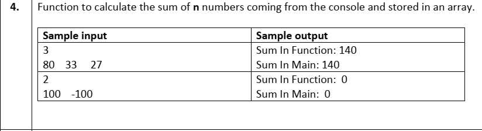

```c
#include <stdio.h>
int sum_Func(int arr[], int n)
{
    int sum = 0;
    for (int i = 0; i < n; i++)
    {
        sum += arr[i];
    }
    printf("Sum In Function: %d\n", sum);
    return sum;
}
int main()
{

    int n;
    scanf("%d", &n);
    int arr[n];

    for (int i = 0; i < n; i++)
    {
        scanf("%d", &arr[i]);
    }

    int sum = sum_Func(arr, n);
    printf("Sum In Main: %d\n", sum);
    return 0;
}
```

 ## 05

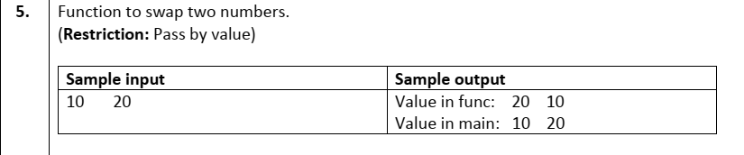
```c
#include <stdio.h>

void swap(int a, int b)
{
    int temp = a;
    a = b;
    b = temp;
    printf("Value in func: %d %d\n", a, b);
}

int main()
{
    int num1, num2;
    scanf("%d %d", &num1, &num2);
    swap(num1, num2);
    printf("Value in main: %d %d\n", num1, num2);
    return 0;
}
```

 ## 06

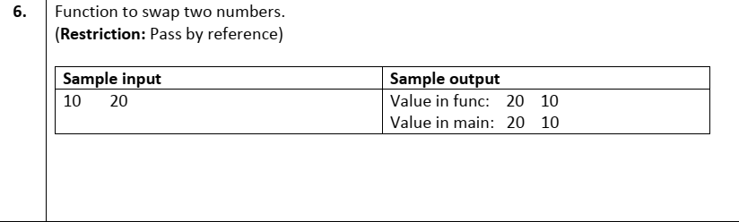
```c
#include <stdio.h>
void swap(int *ptr1, int *ptr2)
{
    int temp = *ptr1;
    *ptr1 = *ptr2;
    *ptr2 = temp;
    printf("Value in func: %d %d\n", *ptr1, *ptr2);
}
int main()
{

    int m, n;
    scanf("%d %d", &m, &n);
    swap(&m, &n);

    printf("Value in main: %d %d\n", m, n);

    return 0;
}
```

 ## 07

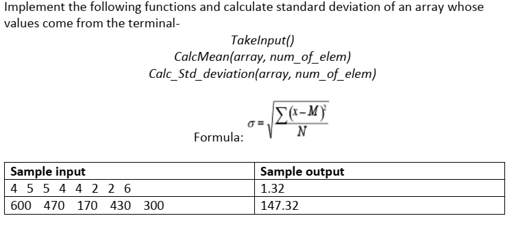
```c
#include <stdio.h>
int det_even(int check_Num)
{
    if (check_Num % 2 == 0)
    {
        return 1;
    }
    else
    {
        return 0;
    }
}
int main()
{
    int n;

    scanf("%d", &n);

    int arr[n];
    for (int i = 0; i < n; i++)
    {
        scanf("%d", &arr[i]);
    }

    for (int i = 0; i < n; i++)
    {
        if (det_even(arr[i]))
        {
            printf("%d ", arr[i]);
        }
    }

    return 0;
}
```

 ## 08

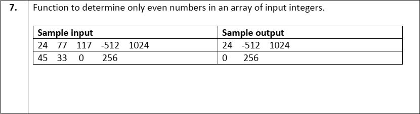

```c
#include <stdio.h>
int find_Minimum(int arr[], int n)
{
    int min = arr[0];
    for (int i = 1; i < n; i++)
    {
        if (min > arr[i])
        {
            min = arr[i];
        }
    }

    return min;
}
int main()
{
    int n;

    scanf("%d", &n);

    int arr[n];
    for (int i = 0; i < n; i++)
    {
        scanf("%d", &arr[i]);
    }

    printf("Minimum Value: %d\n", find_Minimum(arr, n));
    return 0;
}
```

 ## 09

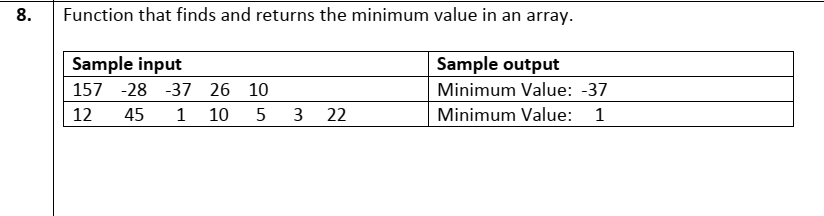

```c
#include <stdio.h>
void multiply_By_2(int arr[], int n)
{
    for (int i = 0; i < n; i++)
    {
        arr[i] *= 2;
    }
}

int main()
{
    int n;

    scanf("%d", &n);

    int arr[n];
    for (int i = 0; i < n; i++)
    {
        scanf("%d", &arr[i]);
    }

    multiply_By_2(arr, n);

    for (int i = 0; i < n; i++)
    {
        printf("%d ", arr[i]);
    }

    return 0;
}
```
 ## 10

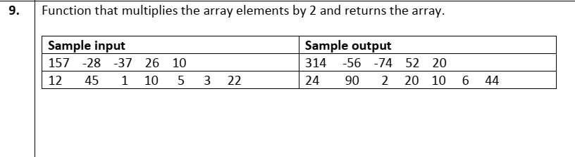

```c
#include <stdio.h>
void sort_Array(int arr[], int size)
{
    for (int i = 0; i < size; i++)
    {
        for (int j = i + 1; j < size; j++)
        {
            if (arr[i] > arr[j])
            {
                int temp = arr[i];
                arr[i] = arr[j];
                arr[j] = temp;
            }
        }
    }
}
int main()
{
    int n;

    scanf("%d", &n);

    int arr[n];
    for (int i = 0; i < n; i++)
    {
        scanf("%d", &arr[i]);
    }
    sort_Array(arr, n);

    for (int i = 0; i < n; i++)
    {
        printf("%d ", arr[i]);
    }

    return 0;
}
```
 ## 11

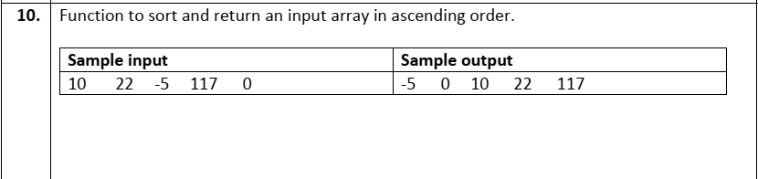
```c
#include <stdio.h>
int isPrime(int value)
{
    for (int i = 2; i * i <= value; i++)
    {
        if (value % i == 0)
        {
            return 0;
            break;
        }
    }

    return 1;
}
int main()
{

    int n;
    scanf("%d", &n);

    if (n != 1 && isPrime(n))
    {
        printf("Prime\n");
    }
    else
    {
        printf("Not Prime\n");
    }

    return 0;
}
```

 ## 12

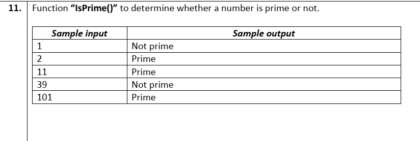
```c
#include <stdio.h>
int isPrime(int value)
{
    for (int i = 2; i * i <= value; i++)
    {
        if (value % i == 0)
        {
            return 0;
            break;
        }
    }

    return 1;
}
void generatePrime(int num)
{
    int count = 0;
    for (int i = 2; i < num; i++)
    {
        if (isPrime(i))
        {
            if (count > 0)
                printf(",");
            printf(" %d", i);
            count++;
        }
    }
}
int main()
{

    int n;
    scanf("%d", &n);

    printf("Prime less than %d: ", n);
    generatePrime(n);
    return 0;
}
```

 ## 13

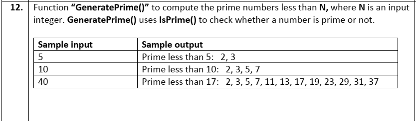
```c
#include <stdio.h>
int isPrime(int value)
{
    for (int i = 2; i * i <= value; i++)
    {
        if (value % i == 0)
        {
            return 0;
            break;
        }
    }

    return 1;
}
void genNthPrime(int nth_Prime)
{
    int count = 0;
    for (int i = 2;; i++)
    {
        if (isPrime(i))
        {
            ++count;
            if (count == nth_Prime)
            {
                printf(" %d \n", i);
                break;
            }
        }
    }
}
int main()
{

    int n;
    scanf("%d", &n);

    printf("%dth Prime:", n);
    genNthPrime(n);
    return 0;
}
```

 ## 14

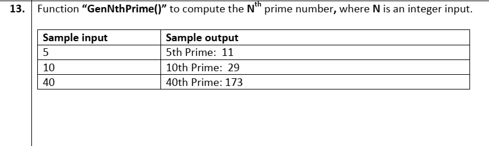
```c
#include<stdio.h>
#include<math.h>
    void takeInput(int arr[], int size)
    {
    
        for (int i = 0; i < size; i++)
        {
            scanf("%d", &arr[i]);
        }
    }
    
    double Calc_Mean(int arr[], int size)
    {
    
        double sum = 0.0;
        for (int i = 0; i < size; i++)
        {
            sum += arr[i];
        }
        return sum / size;
    }
    
    double Calc_Std_deviation(int arr[], int num_of_elem)
    {
        double mean = Calc_Mean(arr, num_of_elem);
        double sum = 0;
        double diff = 0.00;
    
        for (int i = 0; i < num_of_elem; i++)
        {
            diff = arr[i] - mean;
            sum += diff * diff;
        }
        return sqrt(sum / num_of_elem);
    }
    int main()
    {
    
        int n;
        scanf("%d", &n);
        int arr[n];
    
        takeInput(arr, n);
        double mean = Calc_Mean(arr, n);
    
        double std_dev = Calc_Std_deviation(arr, n);
    
        printf("%.2lf", std_dev);
        return 0;
    }
```

 ## 15

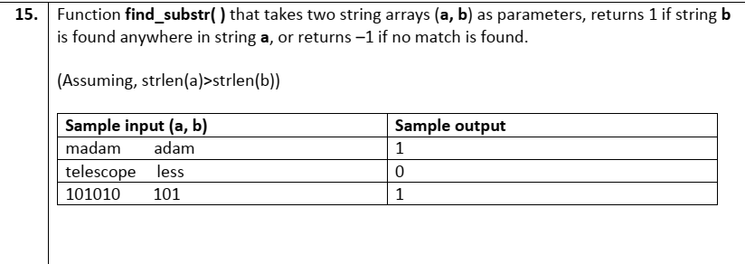
```c
#include <stdio.h>
int check_Sub_String(char str[], int str_lngth, char sub_Str[], int sub_str_lngth)
{
    int flag = 0;
    for (int i = 0; i < str_lngth; i++)
    {
        int track = 0, count = 0;

        if (str[i] == sub_Str[0])
        {
            track = i;
            for (int j = 0; j < sub_str_lngth; j++)
            {

                if (str[track] == sub_Str[j])
                {
                    count++;
                }
                else
                    break;

                track++;
            }
        }
        if (count == sub_str_lngth)
        {
            return 1;
            break;
        }
    }
    return -1;
}
int main()
{
    char str[100], sub_Str[100];
    int lngth = 0, sub_lngth = 0;
    int flag = 0;
    char c;

    while ((c = getchar())!= '\n')
    {
    str[lngth++] =c;

    }

    while ((c = getchar())!= '\n')
    {
    sub_Str[sub_lngth++] = c;
    }

    printf("%d\n", check_Sub_String(str, lngth, sub_Str, sub_lngth));
    return 0;
}
```

 ## 16

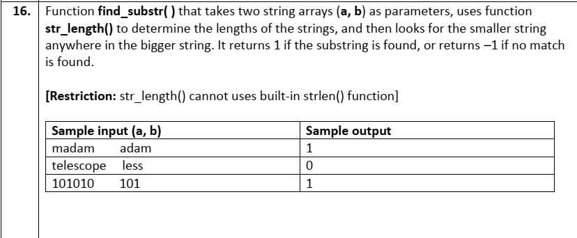
```c
#include<stdio.h>

        int find_substr(char str[], int str_lngth, char sub_Str[], int sub_str_lngth)
        {
            int flag = 0;
            for (int i = 0; i < str_lngth; i++)
            {
                int track = 0, count = 0;
        
                if (str[i] == sub_Str[0])
                {
                    track = i;
                    for (int j = 0; j < sub_str_lngth; j++)
                    {
        
                        if (str[track] == sub_Str[j])
                        {
                            count++;
                        }
                        else
                            break;
        
                        track++;
                    }
                }
                if (count == sub_str_lngth)
                {
                    return 1;
                    break;
                }
            }
            return -1;
        }
        int str_length(char str[])
        {
            int length = 0;
            while (str[length] != '\n')
            {
                length++;
            }
            return length;
        }
        int main()
        {
            char str[100], sub_Str[100];
            int lngth = 0, sub_lngth = 0;
            int check_return = 0;
        
            while (1)
            {
                scanf("%c", &str[lngth]);
        
                if (str[lngth] == '\n')
                {
                    break;
                }
        
                lngth++;
            }
            int str_lngth = str_length(str);
            while (1)
            {
                scanf("%c", &sub_Str[sub_lngth]);
        
                if (sub_Str[sub_lngth] == '\n')
                {
                    break;
                }
        
                sub_lngth++;
            }
        
            int sub_str_lngth = str_length(sub_Str);
        
            if (sub_str_lngth > str_lngth)
            {
                check_return = find_substr(sub_Str, sub_str_lngth, str, str_lngth);
            }
            else
            {
                check_return = find_substr(str, str_lngth, sub_Str, sub_str_lngth);
            }
            if (check_return == 1)
            {
                printf("%d\n", 1);
            }
            else
            {
                printf("%d\n", 0);
            }
        
            return 0;
        }
```
 ## 17

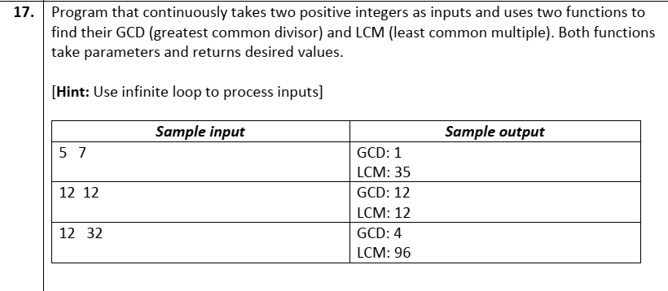
```c
#include <stdio.h>
int gcd(int num1, int num2)
{
    while (num2 != 0)
    {
        int rem = num1 % num2;
        num1 = num2;
        num2 = rem;
    }
    return num1;
}
int lcm(int num1, int num2)
{
    return num1 * num2 / gcd(num1, num2);
}
int main()
{
    while (1)
    {

        int a, b;

        scanf("%d %d", &a, &b);
        printf("GCD: %d\n", gcd(a, b));
        printf("LCM: %d\n", lcm(a, b));
    }

    return 0;
}
```
 ## 18

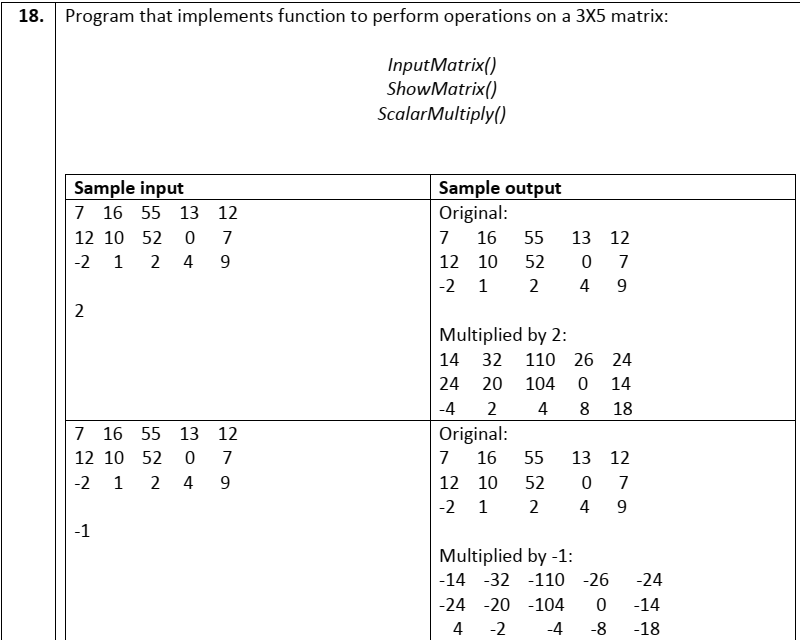
```c
#include <stdio.h>

void scalar_Multiply(int Row, int Col, int mat[][Col], int mult_Value)
{
    printf("\n\nMultiplied by %d:\n", mult_Value);

    for (int i = 0; i < Row; i++)
    {
        for (int j = 0; j < Col; j++)
        {
            mat[i][j] *= mult_Value;
            printf("%d\t", mat[i][j]);
        }
        printf("\n");
    }
}

void show_Matrix(int Row, int Col, int mat[][Col])
{
    printf("Orginal:\n");
    for (int i = 0; i < Row; i++)
    {
        for (int j = 0; j < Col; j++)
        {
            printf("%d\t", mat[i][j]);
        }
        printf("\n");
    }
}
int input_Matrix(int Row, int Col, int mat[][Col])
{

    for (int i = 0; i < Row; i++)
    {
        for (int j = 0; j < Col; j++)
        {
            scanf("%d", &mat[i][j]);
        }
    }

    int multiple_Value;
    scanf("%d", &multiple_Value);
    return multiple_Value;
}

int main()
{
    int Row = 3, Col = 5;
    int mat[Row][Col];
    int mult_Value = input_Matrix(Row, Col, mat);
    show_Matrix(Row, Col, mat);
    scalar_Multiply(Row, Col, mat, mult_Value);
    return 0;
}

```
 ## 19

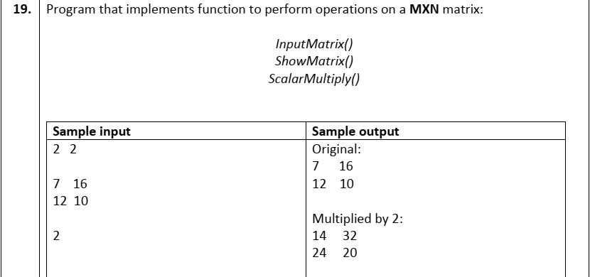
```c
#include <stdio.h>

void scalar_Multiply(int Row, int Col, int mat[][Col], int mult_Value)
{
    printf("\n\nMultiplied by %d:\n", mult_Value);

    for (int i = 0; i < Row; i++)
    {
        for (int j = 0; j < Col; j++)
        {
            mat[i][j] *= mult_Value;
            printf("%d\t", mat[i][j]);
        }
        printf("\n");
    }
}

void show_Matrix(int Row, int Col, int mat[][Col])
{
    printf("Orginal:\n");
    for (int i = 0; i < Row; i++)
    {
        for (int j = 0; j < Col; j++)
        {
            printf("%d\t", mat[i][j]);
        }
        printf("\n");
    }
}
int input_Matrix(int Row, int Col, int mat[][Col])
{

    for (int i = 0; i < Row; i++)
    {
        for (int j = 0; j < Col; j++)
        {
            scanf("%d", &mat[i][j]);
        }
    }

    int multiple_Value;
    scanf("%d", &multiple_Value);

    return multiple_Value;
}

int main()
{
    int Row, Col;
    scanf("%d %d", &Row, &Col);
    int mat[Row][Col];
    int mult_Value = input_Matrix(Row, Col, mat);
    show_Matrix(Row, Col, mat);
    scalar_Multiply(Row, Col, mat, mult_Value);
    return 0;
}
```
 ## 20

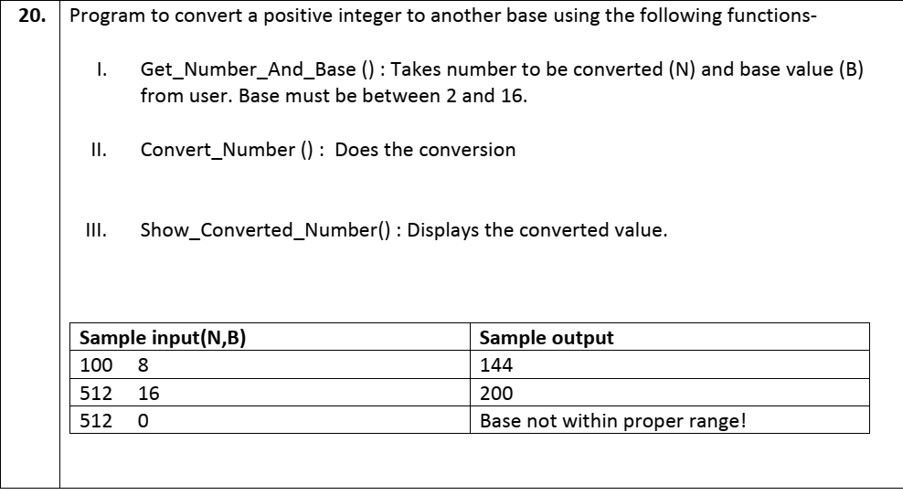
```c
#include <stdio.h>
void Get_Number_And_Base(int *num, int *base)
{
    scanf("%d %d", num, base);
}

int convert_Num(char str[], int size, int num, int base)
{

    int iteration = 0;

    char alphabet[] = {'0', '1', '2', '3', '4', '5', '6', '7', '8', '9', 'A', 'B', 'C', 'D', 'E', 'F'};

    while (num > 0)
    {
        int reminder = num % base;

        str[iteration++] = alphabet[reminder];

        num /= base;
    }

    return iteration - 1;
}
void show_Converted_Number(char str[], int size)
{
    for (int i = size; i >= 0; i--)
    {
        printf("%c", str[i]);
    }
}
int main()
{
    int num, base;
    char str[1000];
    Get_Number_And_Base(&num, &base);
    if (base < 1 || base > 16)
    {
        printf("Base not within proper range!\n");
        return 0;
    }

    int str_Size = convert_Num(str, 1000, num, base);
    show_Converted_Number(str, str_Size);
    return 0;
}
```
