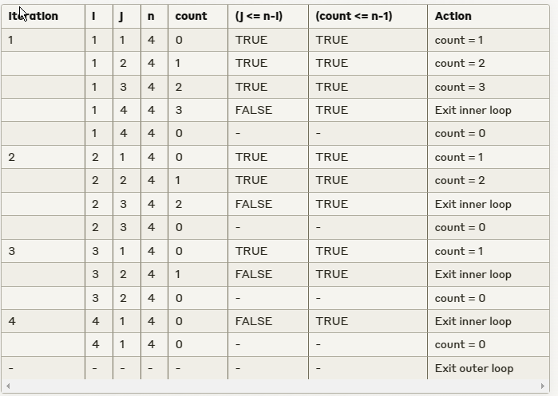

# Fall 22 Questions Solve

## Q1. a
```c
#include <stdio.h>

int main()
{

    int a, b;
    float sum;
    scanf("%d", &a);
    a, b = 10;
    sum = a + b;
    printf("%f", sum);
    return 0;
}

```

## Q1. b
```c


```

## Q1. c
```c
 a= 15
 b =3.000000
 c= 3.000000
 d = 1

```

## Q2. a
```c
output:
16 8 1

```

## Q2. b
```c
#include <stdio.h>

int main() {
    int num = 3, sum = 10, i = 7, j = 2;

    if (num == 1) {
        
    } else if (num == 2) {
        j--; 
        sum += j * 2; 
        i--;
    } 

    if (num == 3) {
        i++; 
        sum = i * j; 
        j--;
    }

    printf("%d %d %d", sum, i, j);
    return 0;
}


```

## Q3. a
```c
#include <stdio.h>

int main()
{

    int n;
    scanf("%d", &n);

    int sum = 0;
    int sequence = 0;
    int track = 5;

    printf("0, ");
    for (int i = 1; i < n; i++)
    {
        sequence += track;
        printf("%d, ", sequence);

        track += 8;
        sum += sequence;
    }

    printf("Sum = %d", sum);
    return 0;
}

```

## Q3. b



## Q4. a


## Q5. b
```c
#include <stdio.h>

int main()
{

    int n;
    scanf("%d", &n);

    for (int i = 1; i <= n; i++)
    {
        for (int j = 1; j <= n; j++)
        {
            if ((i <= n / 2 )&& (i == j || j == n - i + 1))
            {
                printf("* ");
            }
            else if ((i>n/2) && (j == n / 2 + 1))
            {
                printf("* ");
            }
            else
            {
                printf("  ");
            }
            
        }
        printf("\n");
    }
        return 0;
    }

```