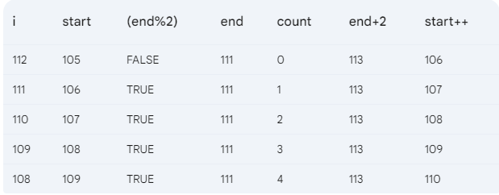
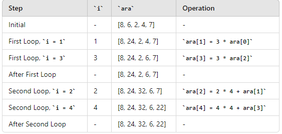
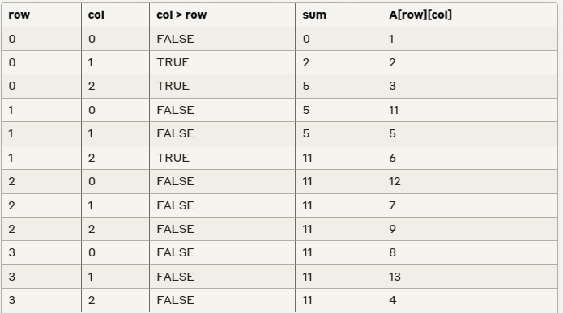

# Fall 23 Solve


## Q1. a

```c


```

## Q1. b

```c
output:
a= 14.000000
b= 3.000000
c= 0.000000
result= 63.000000

```

## Q1. c

```c
input:                     output:
------                     ------
2.3                         2
                            Shakib
                            Imrul

127                         127
                            Mashrafe
                            Mahmudullah
                            Rubel

```

## Q2. a

```c
#include <stdio.h>

int main()
{

    int a, b, c;
    scanf("%d %d %d", &a, &b, &c);

    int result = a-- / b++;

    if (a + b == 1)
    {
        result *= a / c * 2;
        b++;

        result = a * c / b;
        a++;
    }
    else if (a + b == 2 || a + b == 2 || a + b == 3)
    {
        result = a * c / b;
        a++;
    }
    else if (a + b == 4)
    {
        }
    else
    {
        result = 5;
    }

    printf("%d %d %d %d", a, b, c, result);

    return 0;
}

```

## Q2. b



## Q3. a

```c
#include <stdio.h>

int main()
{

    int n;
    scanf("%d", &n);

    for (int i = 1; i <= n; i++)
    {
        for (int j = 1; j <= n; j++)
        {
            if ((i <= n / 2 + 1) && (j == 1 || i == j || j == n - i + 1 || j == n))
            {
                printf("* ");
            }
            else if (j == 1 || j == n)
            {
                printf("* ");
            }
            else
            {
                printf("  ");
            }
        }
        printf("\n");
    }

    return 0;
}

```

## Q3. b

```c
#include <stdio.h>

int main()
{

    int a = 10, b = 20, count = 0;

    int i = b;

    while (i >= a)
    {

        int j = a;
        do
        {
            printf("%d ", j);
            j++;
        } while (j <= b);

        if (b % 2 != 0)
        {
            printf("%d \n", a);
        }
        else
        {
            printf("%d \n", b);
        }

        i--;
    }

    return 0;
}

```

## Q4. b

```c
#include <stdio.h>

int main()
{

    int n;
    scanf("%d", &n);
    float arr[n];

    for (int i = 0; i < n; i++)
    {
        scanf("%f", &arr[i]);
    }

    for (int i = 0; i < n; i++)
    {
        if (arr[i] < 500.00)
        {
            for (int j = i; j < n - 1; j++)
            {
                arr[j] = arr[j + 1];
            }
            n--;
            i--;
        }
    }

    for (int i = 0; i < n; i++)
    {
        printf("%f ", arr[i]);
    }

    printf("\n%d", n);
    return 0;
}

```

## Q5. a



## Q5. b


