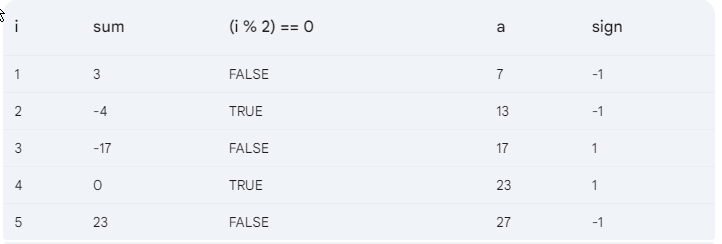
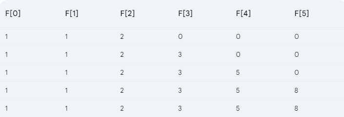

# Spring 22

## Q.1 a

```c
#include <math.h>
#include <stdio.h>

int main()
{

    float n_, m = 5;
    scanf("%f", &n_);

    float p = ((int)n_ % (int)m) / sqrt(6);
    printf("%f", p);
    return 0;
}

```

## Q1. b

```c

```

## Q1. c

```c
output:
a = 33
b = 1.000000
c = 0
d = 3.000000


```

## Q2. a

```c
input:                        ouput:
4                              Begin
                               CSE
                               End

5                              Begin
                               UIU
                               End
                                
10                             Begin
                               UIU
                               End

12                             Begin
                               UIU
                               End


```

## Q2. b

```c
#include <stdio.h>

int main()
{
    char category;
    int work_experience, family_members;
    float family_income;

    scanf(" %c", &category);

    scanf("%d", &work_experience);

    scanf("%d", &family_members);

    scanf("%f", &family_income);

    if (
        (work_experience >= 12 && family_members > 5) ||
        family_income < 1000.50)
    {
        printf("eligible for the bonus!\n");
    }
    else if (
        (category == 'Y' || category == 'Z') &&
        family_members > 8 && family_income < 1100.78)
    {
        printf("eligible for the bonus!\n");
    }
    else if (category == 'X' && family_members > 6)
    {
        printf("eligible for the bonus!\n");
    }
    else
    {
        printf("not eligible for the bonus.\n");
    }

    return 0;
}


```

## Q3. a



## Q3. b

```c
#include <stdio.h>

int main()
{
    int n;
    scanf("%d", &n);

    int dubl = n * 2;
    int sum_Of_Factors = 0;
    for (int i = 1; i <= n / 2; i++)
    {
        if (n % i == 0)
        {
            sum_Of_Factors += i;
                }
    }

    if (sum_Of_Factors + n < dubl)
    {
        printf("Deficient Number");
    }
    else
    {
        printf("Not a Deficient Number");
    }

    return 0;
}

```

## Q4. a



## Q4. b

```c
#include <stdio.h>

int main()
{

    int n, sum = 0;
    scanf("%d", &n);
    int arr[n];
    for (int i = 0; i < n; i++)
        scanf("%d", &arr[i]);

    int max = 0, min = arr[0];
    int max_indx = 0, min_indx = 0;

    for (int i = 0; i < n; i++)
    {
        if (arr[i] > max)
        {
            max = arr[i];
            max_indx = i;
        }
        else if (min > arr[i])
        {
            min = arr[i];
            min_indx = i;
        }
    }

    printf("Max: %d, Index: %d\nMin: %d, Index: %d", max, max_indx, min, min_indx);
    return 0;
}

```

## Q5. b

```c
#include <stdio.h>

int main()
{
    int n;
    scanf("%d", &n);

    for (int i = 1; i <= n; i++)
    {
        for (int j = 1; j <= n; j++)
        {
            if (j == i || j == n - i + 1)
            {
                printf("x");
            }
            else
            {
                printf(" ");
            }
        }
        printf("\n");
    }
    return 0;
}
```
