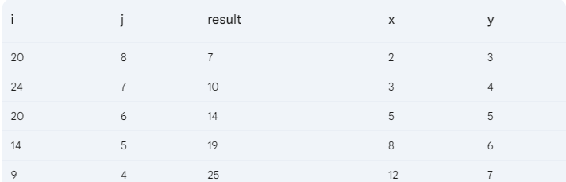
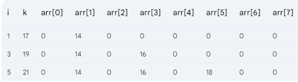
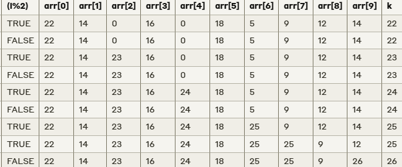
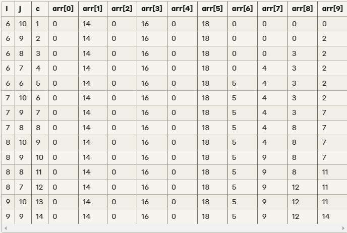

# Spring 23

## Q1. a

```c


```

## Q1. b

```c
a = 3
b =  12.0
c = 2
d =  1.0

```

## Q1. c

```c
input:                      output:
------                     ---------
b = 10                      SPL
                            Spring


b = 2                       Spring

```

## Q2. a

```c
#include <stdio.h>
int main()
{

    int n, a;
    scanf("%d %d", &n, &a);

    switch (n > a)
    {
    case 1:
        switch (n - a > 5)
        {
        case 1:
            printf("Difference is greater than 5\n");
            break;
        default:
            printf("Difference is less than or equal to 5\n");
            break;
        }
        break;
    default:
        printf("Please give a larger value of n\n");
        break;
    }

    return 0;
}


```

## Q2. b



## Q3. a

```c
#include <stdio.h>

int main()
{
    int weeks = 2, days_in_week = 7;
    int i = 1;

    do
    {
        printf("Week: %d\n", i);
        int j = 1;

        do
        {
            if (i % 2 == 0)
            {
                if (j % 2 == 0)
                {
                    printf("  Day: %d\n", j);
                }
            }
            else
            {
                if (j % 2 != 0)
                {
                    printf("  Day: %d\n", j);
                }
            }
            j++;
        } while (j <= days_in_week);

        i++;
    } while (i <= weeks);

    return 0;
}


```

## Q3. b

```c
#include <stdio.h>

int main() {
    int n;
    printf("Enter an integer: ");
    scanf("%d", &n);

    for (int i = 1; i <= n; i++) {
        // Print spaces before the numbers
        for (int j = 1; j <= 2 * (n - i); j++) {
            printf(" ");
        }

        // Print numbers
        int num = 2 * i;
        for (int j = 1; j <= 2 * i - 1; j++) {
            printf("%d", num);
            if (j < i) {
                num += 2;
            } else {
                num -= 2;
            }
            if (j < 2 * i - 1) {
                printf(" ");
            }
        }

        printf("\n");
    }

    return 0;
}

```

## Q4. a

```c
#include <stdio.h>

int main() {
 int n = 100; 
 float arr[n];
 float sum = 0, highest_Cgpa = 0, lowest_Cgpa = 999999;

 int grtr_than_3 = 0,   highest_Cgpa_Count = 0;

 for (int i = 0; i < n; i++)
 {
    scanf("%d", &arr[i]);
    // if Cgpa is greater than 3.00 than sum it and count it
    if (arr[i]> 3.00)
    {
        sum += arr[i];
        grtr_than_3++;

    }
    
    // finding highest Cgpa
    if (highest_Cgpa < arr[i])
    {
        highest_Cgpa = arr[i];
        highest_Cgpa_Count = 1;
    }else if (highest_Cgpa == arr[i]) // finding how many students have highest Cgpa
    {
        highest_Cgpa_Count++;
    }

    // finding lowest Cgpa
    if (lowest_Cgpa > arr[i])
    {
        lowest_Cgpa = arr[i];
    }
    
    
 }
  
 float avg = sum / grtr_than_3;


    return 0;
}

```

## Q5. a

# fist Loop Manual Trace


# Nested loop Manual Trace


# Last Loop Manual Trace


## Q5. b

# Final Output:
```c
 1   2    3    5    8  
 2   3    5    8    13
 3   5    8    13   21
 5   8    13   21   34
 8   13   21   34   55

```