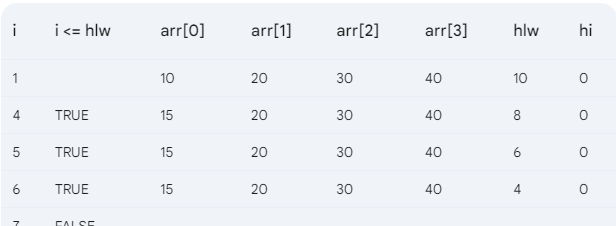

## Spring 24

## Q1. a
```c
#include <stdio.h>
int main()
{
    int Num, a;
    Num = 20 % 3;
    a = Num + 10;
    printf("%d %d\n", Num, a);
    return 0;
}

```

## Q1.b
```c
result = 6
a = 3

```

## Q2a. c
```c
#include <stdio.h>

int main()
{

    int num = 5, sum = 10, i = 4, j = 9;

    if (num == 1)
    {
        sum *= 3;
        sum += --j * 2;
        i--;
    }
    else if (num == 4)
    {
        sum = ++i * j--;
    }

    else if (num == 5)
    {
        i += 10;
    }
    else
    {
        sum *= i++ / j--;
        i = i % j;
    }

    return 0;
}

```

## Q2. b


## Q3. a
```c
#include <stdio.h>

int main()
{

    int n = 5;
    for (int i = 1; i <= n; i++)
    {
        for (int j = 1; j <= n; j++)
        {
            if (i == 1 || i == n || i == (n / 2) + 1 || (i <= n / 2 && j == n) || (i > n / 2 && j == 1))
            {
                printf("* ");
            }
            else
            {
                printf("  ");
            }
        }
        printf("\n");
    }

    return 0;
}
```

## Q3.b
```c

#include <stdio.h>

int main()
{

    int i = 0, count = 0;
    int n = 12345;
    for (; n != 0;)
    {
        printf("%d ", n % 10);
        count++;

        while (i < count)
        {
            printf("%d ", n /= 10);
            i++;
        }
        printf("\n");
    }

    return 0;
}
```

## Q4


## Q5. a
```c
#include <stdio.h>

int main()
{

    int N;
    scanf("%d", &N);
    int arr[N];
    for (
        int i = 0; i < N; i++)
    {
        scanf("%d", &arr[i]);
    }

    int k;
    scanf("%d", &k);

    for (int i = 0; i < N; i++)
    {
        if (i % 2 == 0)
        {
            arr[i] += k;
        }
        else
            arr[i] -= k;
    }

    for (int i = 0; i < N; i++)
    {
        printf("%d ", arr[i]);
    }

    return 0;
}
```