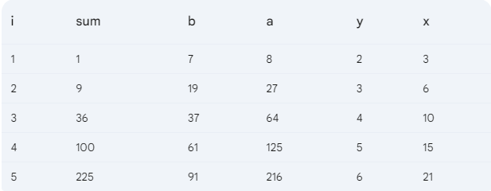
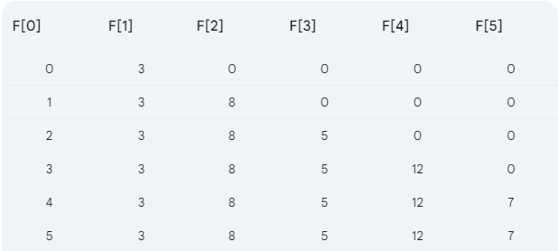

# Summer 22

# Q1.a

```c
#include <stdio.h>

int main()
{

    int num1 = 5;
    float num2;
    char chr = 'q';
    scanf("%f", &num2);
    printf("%d\n", 'a');
    num1 = (int)num2 % chr;

    printf("Result is = %d", num1);
    return 0;
}

```

# Q1.b

```c


```

# Q1.c

```c
 a = 10.000000
 b = 10
 c = 12.500000
 d = 12

```

# Q2. a

```c
input:                            output:
------                           ---------
1                                 12 5 12

2                                 0  0  0

```

# Q2. b



# Q3. a

```c
#include <stdio.h>

int main()
{

    int n = 3, i, j, sum = 0;

    i = 0;
    do
    {
        j = 0;
        do
        {
            if (i == j)
            {
                sum += i + j;
            }
            else if (i > j)
            {
                sum += i + n;
            }
            else
            {
                sum += n - j;
            }

            j++;
        } while (j <= i);

        i++;
    } while (i < n);

    printf("%d\n", sum);

    return 0;
}

```

# Q3. b

```c
#include <stdio.h>

int main()
{

    float sum = 0;
    int pos_Count = 0;

    while (1)
    {
        int input;
        scanf("%d", &input);

        if (input == 0)
        {
            break;
        }
        else if (input > 0)
        {
            sum += input;
            pos_Count++;
        }
    }

    float avg = sum / pos_Count;

    printf("Average = %.2f", avg);
    return 0;
}

```

# Q4. a



# Q4. b

```c
#include <stdio.h>

int main()
{

    int arr[100];
    int n;
    scanf("%d", &n);

    float sum_Of_Odd_index = 0;
    int count_Odd_index = 0;

    for (int i = 0; i < n; i++)
    {
        scanf("%d", &arr[i]);
        if (i % 2 != 0)
        {
            sum_Of_Odd_index += arr[i];
            count_Odd_index++;
        }
    }

    printf("index\t Value\n");
    printf("-----\t -----\n");

    for (int i = 0; i < n; i++)
    {
        printf(" %d\t    %d\n", i, arr[i]);
    }

    float avg = sum_Of_Odd_index / count_Odd_index;

    printf("Average of odd index = %.2f", avg);
    return 0;
}

```

# Q5. b

```c
#include <stdio.h>

int main()
{

    int n;
    scanf("%d", &n);

    for (int i = n; i >= 1; i--)
    {
        for (int j = i; j >= 1; j--)
        {
            printf("%d\t", j * 2);
        }
        printf("\n");
    }

    return 0;
}

```
