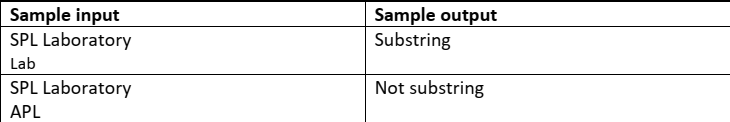
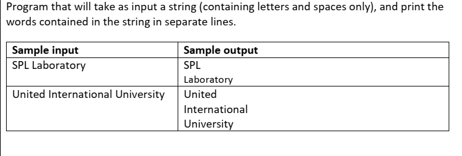

# Strings
## 01


```c
#include <stdio.h>

int main()
{
    char s;
    scanf(" %c", &s);
    if (s >= 'A' && s <= 'Z')
        printf("%c", s + 32);

    else
    {
        printf("Wrong input");
    }
    return 0;
}


## 02


```c
#include <stdio.h>

int main()
{

    char s;
    scanf(" %c", &s);
    if (s >= 'A' && s <= 'Z')
        printf("%c", s + 32);
    else if (s >= 'a' && s <= 'z')
        printf("%c", s - 32);
    else
    {
        printf("Wrong input");
    }

    return 0;
}
```

 ## 03


```c
#include <stdio.h>

int main()
{
    char input;

    scanf("%c", &input);

    if (input >= '0' && input <= '9')
    {
        int value = input - '0';
        printf("%d\n", value);
    }
    else
    {
        printf("Wrong input\n");
    }

    return 0;
}
```

## 04


```c
#include <stdio.h>

int main()
{
    char input[100];
    int length = 0;
    char c;

    int i = 0;
    while ((c = getchar()) != '\n' && i < 99)
    {
        input[i++] = c;
        length++;
    }
    input[i] = '\0';

    printf("Length of the string: %d\n", length);

    return 0;
}
```

 ## 05

```c
#include<stdio.h>
int main(){


char string[100];
int string_length = 0;

while(1){
scanf("%c", &string[string_length]);

if(string[string_length] == '\n')  break;


if(string[string_length] >='A' && string[string_length] <= 'Z'){
	string[string_length] = string[string_length] + 32;
}


string_length++;

}

for(int i = 0; i< string_length; i++){

printf("%c",string[i]);
}
	return 0;
}
```

 ## 06


```c
#include<stdio.h>
int main(){


char string[100];
int string_length = 0;
char c;
while((c =  getchar()) != '\n'){
string[string_length] = c;


if((string[string_length] >='A' && string[string_length] <= 'Z')){
	string[string_length] = string[string_length] + 32;
}else if((string[string_length]>='a' && string[string_length] <= 'z')){

	string[string_length] = string[string_length] - 32;
}


string_length++;

}

for(int i = 0; i< string_length; i++){

printf("%c",string[i]);
}
	return 0;
}
```

 ## 07

```c
#include<stdio.h>
int main(){


char string[100];
int string_length = 0;
char c;
while((c = getchar()) != '\n'){
string[string_length++] = c;
}

int flag = 1;


for(int i = 0; i< string_length; i++){

	if(string[i] != string[string_length-i-1]) {
		flag = 0;
		break;
	}
}

if(flag) {
	printf("Palindrome\n");
}
else{
	
	printf("Not Palindrome\n");
}
	return 0;
}
```

 ## 08


```c

#include<stdio.h>
int main(){

char str1[100], str2[100];

int str1_lngth = 0, str2_lngth = 0;

char c;
while((c = getchar()) != '\n'){
str1[str1_lngth++] = c;
}


while((c = getchar()) != '\n'){
str2[str2_lngth++] = c;
}


int min = (str1_lngth<=str2_lngth)? str1_lngth: str2_lngth;

int flag= 2;

for(int i = 0; i< min; i++){
if(str1[i]< str2[i]){

	flag = 1;
	break;
}

else  if(str2[i]< str1[i]){

	flag = 0;
	break;
}
}

if(flag == 1) {
	for(int i = 0; i< str1_lngth; i++){
		printf("%c",str1[i]);
	}
}
else if(flag == 0) {
	for(int i = 0; i< str2_lngth; i++){
		printf("%c",str2[i]);
	}
}else if(str1_lngth == str2_lngth){

printf("Both equal\n");

}else {
	if(str1_lngth>str2_lngth){

	for(int i = 0; i< str2_lngth; i++){
		printf("%c",str2[i]);
	}

	}else {

	for(int i = 0; i< str1_lngth; i++){
		printf("%c",str1[i]);
	}
	}

}
	return 0;
}
```

 ## 09


```c
#include<stdio.h>
int main(){

char str1[100], str2[100];

int str1_lngth = 0, str2_lngth = 0;

char c;
while((c = getchar()) != '\n'){
str1[str1_lngth++] = c;
}


for(int i =0; i<=str1_lngth; i++){

str2[i] = str1[i];

}

for(int i = 0; i<=str1_lngth;i++){
	printf("%c",str2[i]);
}

	return 0;
}
```
 ## 10


```c
#include<stdio.h>
int main(){

char str1[100], str2[100];

int str1_lngth = 0, str2_lngth= 0;
char c;
while((c = getchar()) != '\n'){
	str1[str1_lngth++] = c;
}


while((c = getchar()) != '\n'){
	str2[str2_lngth++] = c;
}

for(int i=0; i< str2_lngth; i++){
str1[str1_lngth + i]=str2[i];
}

for(int i=0; i< str1_lngth+str2_lngth; i++){
	printf("%c",str1[i]);
}
	return 0;
}
```
 ## 11


```c
#include<stdio.h>
int main(){

char str[100], sub_Str[100];
int lngth = 0, sub_lngth = 0;
int flag = 0;
char c;
while((c= getchar()) != '\n'){
str[lngth++] = c;
}


while((c= getchar()) != '\n'){
sub_Str[sub_lngth++] = c;
}

for(int i = 0; i< lngth; i++){
	int track = 0, count = 0;

if(str[i] == sub_Str[0]){
	track = i;	
	for(int j=0; j< sub_lngth; j++){
	
		if(str[track] == sub_Str[j]){
			count++;
		}else break;


			track++;
	}
}
if(count == sub_lngth){
	flag = 1;
	break;
}


}
 if(flag) printf("Substring\n");
 else printf("Not substring\n");
	return 0;
}
```

 ## 12


```c
#include<stdio.h>
int main(){

char string[100];
int lngth = 0;
char c;
while((c = getchar())!= '\n'){
	string[lngth++] = c;
}

for(int i= 0; i< lngth; i++){
	if(string[i] == ' ')
    printf("\n");
else
	printf("%c",string[i]);
}


	return 0;
}
```