# Loop
## 01

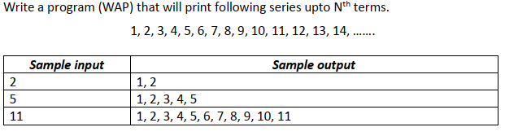

```c
#include <stdio.h>

void main() {
    int n;
    scanf("%d", &n);

    for (int i = 1; i <= n; i++) {
        printf("%d, ", i);
    }
}

```

## 02

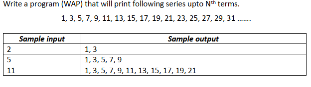
```c
#include<stdio.h>

void main() {
    int n, term;
    scanf("%d", &n);

    for (int i = 1; i<=n; i++) {
        term = 2*(i-1)+1;
        printf("%d, ", term);
    }
}
```

 ## 03

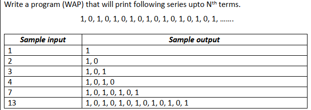
```c
#include<stdio.h>

void main() {
    int n;
    scanf("%d", &n);

    for(int i = 1; i<=n; i++) {
        if(i%2 != 0) 
            printf("1, ");
        else
            printf("0, ");
    }
}
```

## 04

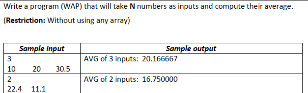
```c
#include<stdio.h>

void main() {
    float n, term, sum=0;
    scanf("%f", &n);

    for(int i = 1; i<=n; i++) {
        scanf("%f", &term);
        sum = sum + term;
    }
    printf("AVG of %.0f inputs: %f", n,(sum/n));
}
```

 ## 05

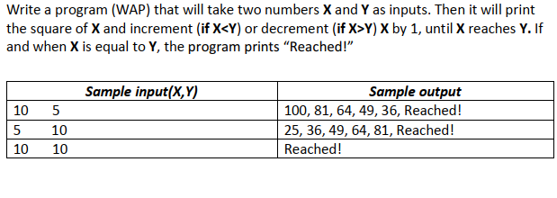
```c
#include<stdio.h>
#include<math.h>

void main() {
    int x, y;
    scanf("%d %d", &x, &y);

    int i = 1;
    while (1) {
        
        float sq = pow(x,2);
        //int sq = x*x;

        if(x<y) {
            printf("%f, ", sq);
            x++;
        }
        else if(x>y) {
            printf("%f, ", sq);
            x--;
        }
        else if(x==y) {
            printf("Reached!");
            break;
        }
    }
    
}
```

 ## 06

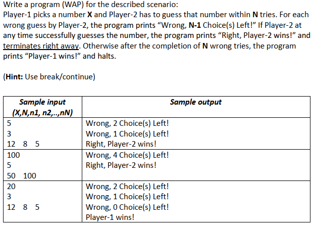
```c
#include<stdio.h>

void main() {
    int X, N, n;
    scanf("%d %d", &X, &N); // X = player1, N = tries, n = player2

    for (int i = 1; ; i++) {
        scanf("%d", &n);

        if(n != X) {
            N--;
            printf("Wrong, %d choices left!\n", N);
        }
        else if(n == X) {
            printf("Right, Player-2 wins!\n");
            break;
        }
        if(N == 0) {
            printf("Player-1 wins!\n");
            break;
        }
    }
}
```

 ## 07

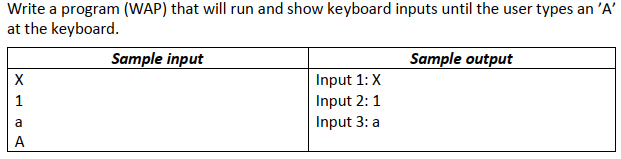
```c
#include<stdio.h>

void main() {
    char ch;
    int count=1;

    for(int i = 1; ; i++) {
        scanf(" %c", &ch);

        if(ch == 'A')
            break;
        else {
            printf("Input %d: %c\n", count, ch);
            count++;
        }
            
    }
}
```

 ## 08


```c
#include<stdio.h>

void main() {
    int num, store;
    scanf("%d", &num);

    while(1) {
        store = num % 10;
        num = num / 10;

        printf("%d", store);

        if(num == 0)
            break;
    }
}
```

 ## 09

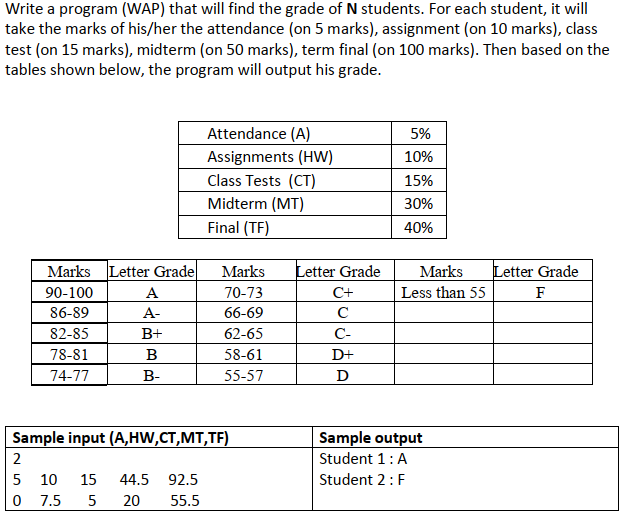
```c
#include<stdio.h>

void main() {
    float N;
    scanf("%f", &N);

    for (int i = 1; i <= N; i++) {
        float A, HW, CT, MT, TF, mark;
        scanf("%f %f %f %f %f", &A, &HW, &CT, &MT, &TF);

        mark = A + HW + CT + (MT*0.6) + (TF*0.4); // MT = 50 (total mark)
						  // 50 * x = 30 (converting to 30);
						  // x = 0.6; multiply 'x' with the obtained mark to convert to 30;

    if(mark>= 90 && mark<=100)
        printf("Student %d: A\n", i);
    else if(mark >= 86)
        printf("Student %d: A-\n", i);
    else if(mark >= 82)
        printf("Student %d: B+\n", i);
    else if(mark >= 78)
        printf("Student %d: B\n", i);
    else if(mark >= 74)
        printf("Student %d: B-\n", i);
    else if(mark >= 70)
        printf("Student %d: C+\n", i);
    else if(mark >= 66)
        printf("Student %d: C\n", i);
    else if(mark >= 62)
        printf("Student %d: C-\n", i);
    else if(mark >= 58)
        printf("Student %d: D+\n", i);
    else if(mark >= 55)
        printf("Student %d: D\n", i);
    else if(mark < 55)
        printf("Student %d: F\n", i);

    }
        
}
```
 ## 10

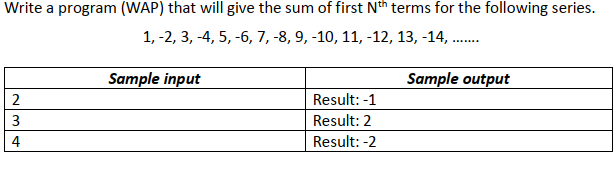
```c
#include<stdio.h>

void main() {
    int term,number, sum=0;
    scanf("%d", &term);
    

    for (int i=1; i<=term ;i++) {
        if(i%2 != 0)
            number = i;
        else
            number = -i;

        sum = sum + number;
    }
    printf("Result: %d", sum);
}
```
 ## 11

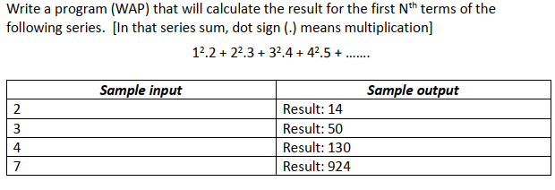
```c
#include<stdio.h>
#include<math.h>

void main() {
    int term, sum=0, series;
    scanf("%d", &term);

    for (int i = 1; i <= term; i++) {
        series = pow(i,2)*(i+1);

        sum = sum + series;
    }
    printf("Result: %d", sum);
    
}
```

 ## 12

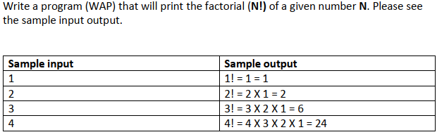
```c
#include<stdio.h>

void main() {
    int n, fact = 1;
    scanf("%d", &n);
    printf("%d! = ", n);

    for (int i = n; ; i--) {
        fact = fact * i;
        printf("%d ", i);

        if(i==1)
            break;

        printf("X ");
    }
    printf("= %d", fact);
}
```

 ## 13

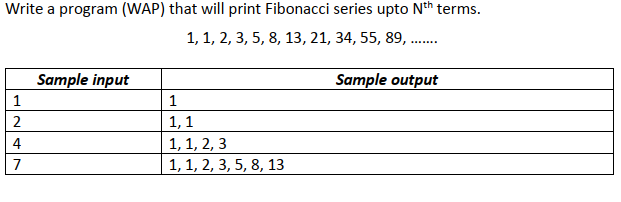
```c
#include<stdio.h>

    void main() {
        int n;
        scanf("%d", &n);
    
        int a = 1;   // 1st term
        int b = 1;   // 2nd term
    
        for (int i = 1; i <= n; i++)
        {
            printf("%d, ", a);
            int result = a+b;   // 3rd term
            a = b;
            b = result;
        }
        
    }
```

 ## 14

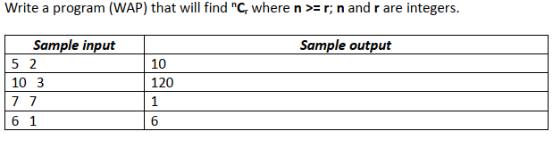
```c
#include<stdio.h>

void main() {
    int n, r, fact1=1, fact2=1, fact3=1;
    scanf("%d %d", &n, &r);

    if(n>=r) {
        for (int i = 1; i <= n; i++) {
            fact1 = fact1*i;
        }
        for (int i = 1; i <= r; i++) {
            fact2 = fact2*i;
        }
        for (int i = 1; i <= (n-r); i++) {
            fact3 = fact3*i;
        }
        printf("%d", fact1/(fact2 * fact3));
    }
}
```

 ## 15

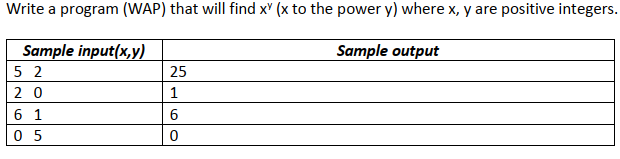
```c
#include<stdio.h>
#include<math.h>

void main() {
    float x,y;
    scanf("%f %f", &x, &y);
    
    float result = pow(x,y);
    printf("%0.0f", result);
}
```

 ## 16

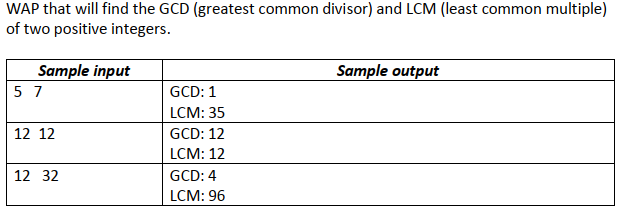
```c
#include<stdio.h>

void main() {
    int num1, num2, GCD, LCM;
    scanf("%d %d", &num1, &num2);

    int max = (num1 > num2) ? num1 : num2;
    
    for (int i = max; ; i++) {
        if ((i%num1 == 0) && (i%num2 ==0)) {
            LCM = i;
            break;
        }
        
    }
    GCD = (num1 * num2) / LCM;
    printf("GCD: %d\n", GCD);
    printf("LCM: %d\n", LCM);
    
}
```
 ## 17

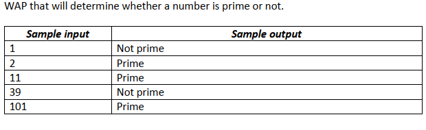
```c
#include <stdio.h>

void main() {

  int n, flag = 1;  // 1 -> true, 0 -> false, flag = 1 (prime)

  printf("n: ");
  scanf("%d", &n);

  // 0 and 1 are not prime numbers
  // change flag to 0 for non-prime number
  if (n == 0 || n == 1)
     flag = 0;

  for (int i = 2; i < n ; i++)
    {
     // if n is divisible by i, then n is not prime
     // change flag to 0 for non-prime number
     if (n % i == 0) {
          flag = 0;
          break;
        }
    }

  // flag is 1 for prime numbers
  if (flag == 1)
    printf("Prime");
  else
    printf("Not prime");
}
```
 ## 18

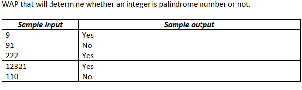
```c

#include <stdio.h>

void main() {
    int num, org_num, last_num, reversed_num = 0;

    scanf("%d", &num);
    org_num = num;

    while (num != 0) { // Reverse the number
        last_num = num % 10;
        reversed_num = reversed_num * 10 + last_num;
        num /= 10;
    }

    if (org_num == reversed_num) {
        printf("Yes");
    } else {
        printf("No");
    }
}
```
 ## 19

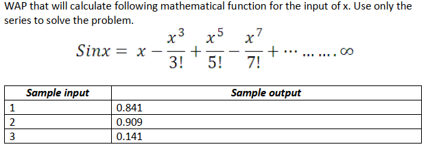
```c
    #include 
    
        int main() {
            double result = 0;
            int sign = 1;
            double x;
        
            scanf("%lf", &x);
        
        
        
            for (int i = 1; i <= 20; i += 2) {
                double term = 1;
                long long fact = 1;
        
                for (int j = 1; j <= i; j++) {
                    term *= x;  // Calculate x raised to the power of i
                }
        
                for (int j = 1; j <= i; j++) {
                    fact *= j;  // Calculate factorial of i
                }
        
                result += sign * (term / fact);
                sign = -sign;  // Change the sign for the next term
            }
        
            printf("%.3lf\n", result);
        
            return 0;
        }
```
 ## 20

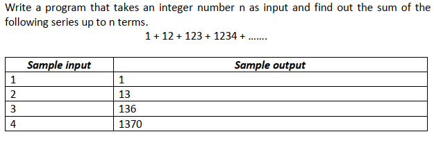
```c
#include <stdio.h>

void main() {
    int n;
    int num = 0;
    int sum = 0;

    scanf("%d", &n);

    for (int i = 1; i <= n; i++) {
        num = num * 10 + i;
        sum += num;
    }

    printf("%d\n",sum);
}
```
