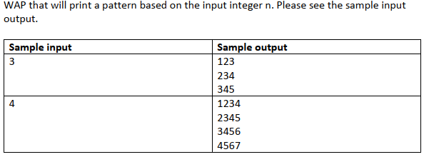

# Nested Loop
## 01


```c
#include <stdio.h>
/*
1 2 3
1 2 3
1 2 3
*/

void main() {
    int n;
    scanf("%d", &n);

    for (int i = 1; i <= n; i++) {
        for (int j = 1; j <= n; j++) {
            printf("%d", j);
        }
        printf("\n");
    }
}

```

## 02


```c
#include <stdio.h>
/*
1 2 3
2 3 4
3 4 5
*/
void main() {
    int n; 
    scanf("%d", &n);

    for (int i = 1; i <= n; i++) {
        for (int j = i; j < i+n; j++) {
            printf("%d ", j);
        }
        printf("\n");
    }
}
```

 ## 03


```c
#include <stdio.h>
/*
1
2 3
3 4 5
*/
void main() {
    int n; 
    scanf("%d", &n);

    for (int i = 1; i <= n; i++) {
        for (int j = i; j < 2*i; j++) {
            printf("%d ", j);
        }
        printf("\n");
    }
}
```

## 04


```c
#include <stdio.h>
/*
_ _ 1
_ 2 2
3 3 3
*/
void main() {
    int n; 
    scanf("%d", &n);

    for (int i = 1; i <= n; i++) {
        for (int j = 1; j <= n-i; j++) {
            printf("_", j);
        }
        for (int j = 1; j <= i; j++) {
            printf("%d", i);
        }
        printf("\n");
    }
}
```

 ## 05


```c
#include <stdio.h>
/*
3 
3 2 
3 2 1 
*/

void main() {
    int n; 
    scanf("%d", &n);

    for (int i = n; i >= 1; i--) {
        for (int j = n; j >= i; j--) {
            printf("%d ", j);
        }
        printf("\n");
    }
}
```

 ## 06


```c
#include<stdio.h>
/*
1 
1 2 
1 2 3 
*/
void main() {
    int n;
    scanf("%d", &n);

    for (int i = 1; i <= n; i++) {
        for (int j = 1; j <= i; j++) {
            printf("%d ", j);
        }
        printf("\n");
    }
}
```

 ## 07


```c
#include <stdio.h>
/*

* * * * 
* * * * 
* * * * 
* * * *

*/
void main() {
    int n; 
    scanf("%d", &n);

    for (int i = 1; i <= n; i++) {
        for (int j = 1; j <= n; j++) {
            printf("* ");
        }
        printf("\n");
    }
}
```

 ## 08


```c
#include <stdio.h>
/*

* * * 
* * 
* 

*/

void main() {
    int n; 
    scanf("%d", &n);

    for (int i = n; i >= 1; i--) {
        for (int j = 1; j <= i; j++) {
            printf("* ");
        }
        printf("\n");
    }
}
```

 ## 09


```c
#include <stdio.h>
/*
101     123        
010     234
101     345
*/

void main() {
    int n; 
    scanf("%d", &n);

    for (int i = 1; i <= n; i++) {
        for (int j = i; j < n+i; j++) {
            printf("%d", j%2);
        }
        printf("\n");
    }
}
```
 ## 10


```c
#include <stdio.h>
/*
_ _ * 
_ * * 
* * * 

*/

void main() {
    int n; 
    scanf("%d", &n);

    for(int i = 1; i <= n; i++) {
        for(int j = 1; j <= n-i; j++) {
            printf("_ ", j);
        }
        for(int j = 1; j <= i; j++) {
            printf("* ", j);
        }
        printf("\n");
    }
}
```
 ## 11


```c
#include <stdio.h>
/*
____*
___***
__*****
_*******
*********

*/

void main() {
    int n;
    scanf("%d", &n);

    for (int i = 1; i <= n; i++) {
        for (int j = 1; j <= n-i; j++) {
            printf("_");
        }
        for (int k = 1; k <= i * 2 - 1; k++) {
            printf("*");
        }
        printf("\n");
    }
}
```

 ## 12


```c
#include<stdio.h>
/*

__*
_***
*****
_***
__*

*/
void main() {
    int n;
    scanf("%d", &n);

    for (int i = 1; i <= (n/2)+1; i++) {
        for (int j = 1; j <= (n/2)+1-i; j++) {
            printf("_");
        }
        for (int k = 1; k <= 2*i-1; k++) {
            printf("*");
        }
        printf("\n");
    }

    for (int i = n/2; i >= 1; i--) {
        for (int j = 1; j <= n/2 +1-i; j++) {
            printf("_");
        }
        for (int k = 1; k <= 2*i-1; k++) {
            printf("*");
        }
        printf("\n");
    }
}
```

 ## 13


```c
#include<stdio.h>
/*
1___1
12_21
12321
*/

void main() {
    int n;
    scanf("%d", &n);

    for (int i = 1; i <= n; i++) {
        for (int j = 1; j <= n*2-1-i; j++) {
            if (j <= i) {
                printf("%d", j);
            } else {
                printf("_");
            }
        }
        
        for (int k = i; k >= 1; k--) {
            printf("%d", k);
        }    
        printf("\n");  
    }      
}
```

 ## 14


```c
#include<stdio.h>
/*
*****
*___*
*****
*___*
*****
*/

void main() {
    int n;
    scanf("%d", &n);

    for (int i = 1; i <= n; i++) {
        for (int j = 1; j <= n; j++) {
            if (i % 2 != 0) {
                printf("*");
            } else {
                if (j == 1 || j == n) {
                    printf("*");
                }
                else {
                    printf("_");
                }
            }
        }
        printf("\n");
    }
```

 ## 15


```c
#include<stdio.h>
/*
ZZZZZ
   Z
  Z
 Z
ZZZZZ
*/

void main() {
    int n;
    scanf("%d", &n);

    for (int i = 1; i <= n; i++) {
        for (int j = 1; j <= n; j++) {
            if (i == 1 || i == n) {
                printf("Z");
            } else {
                if (j < n-i+1) {
                    printf(" ");
                } 
                else if(j == n-i+1){
                    printf("Z");
                }
            }    
        }
        printf("\n");   
    }
}
```

 ## 16


```c
#include<stdio.h>
/*

*___*
_*_*_
__*__
_*_*_
*___*

*/

void main() {
    int n;
    scanf("%d", &n);

    for (int i = 1; i <= n; i++) {
        for (int j = 1; j <= n; j++) {
            if (j == i || j == n-i+1) {
                printf("*");
            }
            else {
                printf("_");
            }
        }
        printf("\n");
    }
}
```
 ## 17


```c
#include <stdio.h>

int main() {
  
    int rows; scanf("%d", &rows);
   
    for (int i = 1; i <= rows/2 + 1; i++)
    {
       for (int j = 1; j <= rows; j++)
       {
        if (j == rows/2-i+2 || j == rows/2+1 || j == (2*i - i)+ rows/2 || i == rows/2 +1)
         {
           printf("$");
         }else printf("_");
         
       }
   
      printf("\n"); 
        
   }
   
       for (int i = rows/2; i >= 1; i--)
    {
       for (int j = 1; j <= rows; j++)
       {
     if (j == rows/2-i+2 || j == rows/2+1 || j == (2*i - i)+ rows/2 || i == rows/2 +1)
         {
           printf("$");
         }else printf("_");
          
       }
   
      printf("\n"); 
        
    }
    
       return 0;
   }
```
 ## 18


```c

#include<stdio.h>

void main() {
    int n;
    scanf("%d", &n);

    for (int i = 1; i <= n; i++) {
        for (int j = 1; j <= n; j++) {
            if (j == 1 || j == n || i == (n/2)+1) {
                printf("H ");
            } else {
                printf("  ");
            }   
        }
        printf("\n");
    }    
}
```
